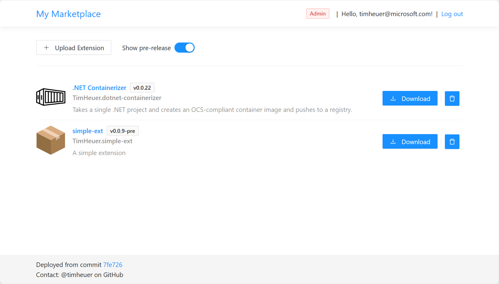

# My Marketplace
This is a sample application to serve as a place to host private VS Code extensions.  

It is not official.  It also does not automatically enable you to connect to it from within VS Code itself.

To install an extension from this marketplace, you will need to download the .vsix file and install it manually.

## How to use
You'll need to have an Azure AD app registration and configure it in either your appsettings.json file or in environment/config for the deployed app.

You need to assign a group Users to the app registration and add users to that group.

## Credits
This was inspired by [Prashant](https://github.com/prashantvc)'s https://github.com/prashantvc/extensions repository which is a React front-end application and I wanted to convert this completely to .NET and Blazor.  All credit for the idea and functionality in the initial implementation goes to Prashant.

Default icons used in this app are from:
- <a href="https://www.flaticon.com/free-icons/box" title="box icons">Box icons created by Good Ware - Flaticon</a>
- <a href="https://www.flaticon.com/free-icons/marketplace" title="marketplace icons">Marketplace icons created by DinosoftLabs - Flaticon</a>